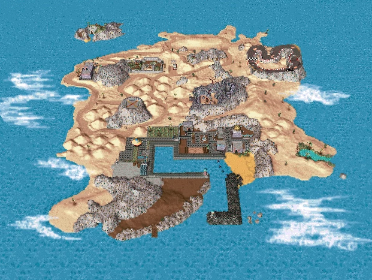

# Island in C

This is a project that uses pthreads to simulate the behaviour of balls raining in an Island.

## Island Map 

## General Points

- The Map has different levels depending on the height and it has a color assigned to it.
- The colors from low to high are: blue, cyan, green, yellow, red, magenta. (Blue is the lowest, Magenta is the highest).

## Getting Started

- Use the command to compile the program: gcc -o island island.c -pthread.

### Prerequisites

- You need to have a C compiler and the libraries of pthreads to be able to run this project.

### Installing

- Download this repo and use the command line to run the C program.

## Running the tests

- Since this is a program in C, if you want more information on the testing side, we recommend using GDB to test the files.

## Deployment

Add additional notes about how to deploy this on a live system

## Built With

* [Dropwizard](http://www.dropwizard.io/1.0.2/docs/) - The web framework used
* [Maven](https://maven.apache.org/) - Dependency Management
* [ROME](https://rometools.github.io/rome/) - Used to generate RSS Feeds
* The Advanced Programming Class in Tecnológico de Monterrey Campus Guadalajara. Obed Nehemías Muñoz Reynoso

## Contributing

Contributing to the Open Source Community

## Versioning

Version 1.0.0 of the Repo

## Authors

Francisco Sánchez Salomón A01634745 https://github.com/FranciscoSnzITESM 
Hector Humberto Herrera Macías A01632115 https://github.com/hecH98
Daniel Lepe Vega A01633986 https://github.com/DanielLepeVega

## Creating a table

| Concept                      | Grade |
|------------------------------|-------|
| Architecture Document        | 20%   |
| Multithreaded implementation | 30%   |
| Build Automation             | 20%   |
| Coding best practices        | 10%   |
| Presentation                 | 20%   |
| TOTAL                        | 100%  |

## Acknowledgments

* This is a project that helped us understand more the use of threads in a real life situation.
* Inspiration, the inspiration for this project was to create an easy to use threads program to understand the use of this in real life simulations.
* Thanks to the Advanced Programming Class for letting us have fun with a project like this.